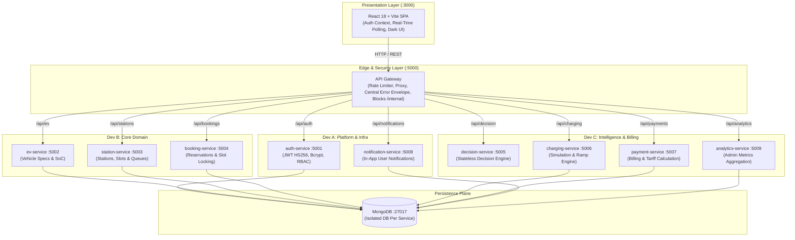

# ⚡ Autonomous EV Charging System

> **Distributed Multi-Service Platform for Autonomous EV Routing, Real-Time Slot Reservation, Simulated Fast Charging & Dynamic Tariffs**

[](https://nodejs.org)
[](https://expressjs.com)
[](https://mongodb.com)
[](https://docker.com)
[](infra/kubernetes/)
[](frontend/)

---

## 📌 Executive Summary

The **Autonomous EV Charging System** is an enterprise-grade microservices architecture designed to solve urban EV charging bottlenecks. It connects electric vehicles with charging stations through an autonomous multi-factor recommendation engine that balances distance, charging speeds, dynamic tariffs, queue length, and vehicle State of Charge (SoC).

### Key Highlights
- **10 Microservices + React SPA**: Cleanly decoupled boundaries with independent databases per domain.
- **Autonomous Decision Engine**: Deterministic multi-criteria decision algorithm with priority boosting for depleted batteries.
- **Dual Security Model**: Public routes protected by JWT (`HS256`); internal service-to-service calls secured via `x-internal-key`.
- **Zero-Interference Ownership**: Strict domain separation between 3 teams (Platform, Core Domain, Intelligence).
- **Containerized & Orchestrated**: Complete Docker Compose development and production environments, along with Kubernetes manifests with HPA auto-scaling.

---

## 🏛️ System Architecture



---

## 🧭 Service Directory & Team Ownership

| Service | Folder | Port | Database | Primary Owner | Description |
|---|---|---|---|---|---|
| **api-gateway** | `services/api-gateway/` | **5000** | *None* | **Dev A** (Platform) | Reverse proxy, rate limiting (100 req/min), blocks `/internal` |
| **auth-service** | `services/auth-service/` | **5001** | `auth_db` | **Dev A** (Platform) | Registration, login, profile, password hashing, JWT tokens |
| **ev-service** | `services/ev-service/` | **5002** | `ev_db` | **Dev B** (Core) | Vehicle registry, battery capacity, current state of charge |
| **station-service** | `services/station-service/` | **5003** | `station_db` | **Dev B** (Core) | Station metadata, slot state (`FREE\|BOOKED\|CHARGING`), seed data |
| **booking-service** | `services/booking-service/` | **5004** | `booking_db` | **Dev B** (Core) | Slot reservations, queue increments, cancellation lifecycle |
| **decision-service** | `services/decision-service/` | **5005** | *None* | **Dev C** (Intel) | Stateless multi-criteria ranking algorithm (Haversine, price, speed) |
| **charging-service** | `services/charging-service/` | **5006** | `charging_db` | **Dev C** (Intel) | Simulated charging sessions (`SIM_SPEEDUP`), battery ramp |
| **payment-service** | `services/payment-service/` | **5007** | `payment_db` | **Dev C** (Intel) | Billing calculations (`energyKwh * price`), payment checkout |
| **notification-service**| `services/notification-service/`| **5008** | `notification_db` | **Dev A** (Platform) | Real-time event notifications for users |
| **analytics-service** | `services/analytics-service/` | **5009** | `analytics_db` | **Dev C** (Intel) | Admin operational intelligence & daily energy statistics |
| **frontend** | `frontend/` | **3000** | *None* | **Dev A** (Shell) | React 18 + Vite SPA, auth context, dark UI |

---

## ⚙️ Environment Variables Table

All configurations are centralized in `.env.example`:

| Variable | Default Value | Purpose |
|---|---|---|
| `NODE_ENV` | `development` | Runtime environment mode |
| `JWT_SECRET` | `supersecretjwtkey_ev_2026_change_in_prod` | Signing secret for HS256 auth tokens |
| `INTERNAL_KEY` | `internal_secret_key_2026_ev_system` | Shared secret header (`x-internal-key`) for inter-service communication |
| `MONGO_PORT` | `27017` | Port for MongoDB instance |
| `GATEWAY_PORT` | `5000` | Port for central API Gateway |
| `AUTH_PORT` | `5001` | Port for Auth Service |
| `EV_PORT` | `5002` | Port for EV Service |
| `STATION_PORT` | `5003` | Port for Station Service |
| `BOOKING_PORT` | `5004` | Port for Booking Service |
| `DECISION_PORT` | `5005` | Port for Decision Recommendation Engine |
| `CHARGING_PORT` | `5006` | Port for Charging Simulation Service |
| `PAYMENT_PORT` | `5007` | Port for Payment & Billing Service |
| `NOTIFICATION_PORT`| `5008` | Port for Notification Service |
| `ANALYTICS_PORT` | `5009` | Port for Analytics Service |
| `FRONTEND_PORT` | `3000` | Port for Frontend Web SPA |

---

## 🚀 Running the System

### Option A: Running with Docker Compose (Recommended for Local Dev)

```bash
# 1. Clone repo and copy environment file
git clone https://github.com/classaxar/Autonomous-EV-Charging-System.git
cd Autonomous-EV-Charging-System
cp .env.example .env

# 2. Build and start all 10 microservices, frontend, and MongoDB
docker compose up -d --build

# 3. Check container statuses
docker compose ps

# 4. Open UI in browser:
# http://localhost:3000
```

To run with pre-built production images:
```bash
docker compose -f docker-compose.prod.yml up -d
```

To stop:
```bash
docker compose down -v
```

---

### Option B: Running with Kubernetes (`infra/kubernetes/`)

Deploy to any Kubernetes cluster (Minikube, Kind, or Cloud K8s):

```bash
# 1. Start Minikube & enable metrics-server
minikube start --cpus=4 --memory=8192
minikube addons enable metrics-server

# 2. Apply all manifests in dependency order
kubectl apply -f infra/kubernetes/namespace.yaml
kubectl apply -f infra/kubernetes/configmap.yaml
kubectl apply -f infra/kubernetes/secret.yaml
kubectl apply -f infra/kubernetes/mongodb.yaml
kubectl apply -f infra/kubernetes/auth-service.yaml
kubectl apply -f infra/kubernetes/ev-service.yaml
kubectl apply -f infra/kubernetes/station-service.yaml
kubectl apply -f infra/kubernetes/booking-service.yaml
kubectl apply -f infra/kubernetes/decision-service.yaml
kubectl apply -f infra/kubernetes/charging-service.yaml
kubectl apply -f infra/kubernetes/payment-service.yaml
kubectl apply -f infra/kubernetes/notification-service.yaml
kubectl apply -f infra/kubernetes/analytics-service.yaml
kubectl apply -f infra/kubernetes/api-gateway.yaml
kubectl apply -f infra/kubernetes/frontend.yaml
kubectl apply -f infra/kubernetes/ingress.yaml
kubectl apply -f infra/kubernetes/hpa.yaml

# 3. Watch pods transition to Ready
kubectl get pods -n ev-system -w

# 4. Access Frontend
minikube service frontend -n ev-system
```

Detailed scaling and resilience testing instructions are provided in [scripts/k8s-demo.md](scripts/k8s-demo.md).

---

## 🔒 Security & Contracts

- **Authentication**: JWT `HS256`, Bearer header token on all `/api/*` endpoints except auth and `/health`.
- **Internal Protection**: Header `x-internal-key` is required on all `/internal/*` routes.
- **Contract Reference**: See `RULEBOOK.md` (Section 6) for endpoint schemas.
- **Architecture Details**: See [docs/architecture.md](docs/architecture.md).
- **Viva Outline**: See [docs/presentation-outline.md](docs/presentation-outline.md).
